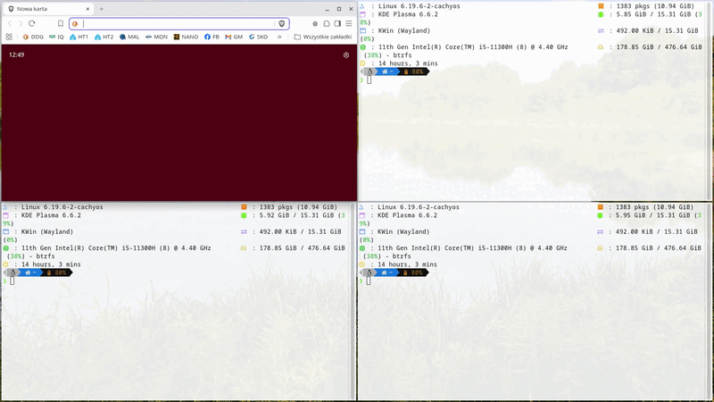

# 🧩 KLeftHandTiler

**Window tiling script for KWin (KDE Plasma 6+)**

Designed for **left-hand keyboard shortcuts**, **per-desktop/activity layouts**,  
**drag-to-reorder windows**, and a **constraint-aware layout engine with live resize**.

---

# 🚀 What's new in v2.0

- 🧠 New **model-based layout engine**
- 🔄 **Live resize** (real-time window resizing)
- 📐 **Constraint-aware tiling** (min sizes respected)
- 🧩 Improved **left-main layout behavior**
- ⚡ Better performance (layout caching + throttling)
- ⌨️ New controls: **swap windows + grow/shrink**

---

# 🎬 Preview

---

## ✨ How it works

1. Open 2–5 windows  
2. Press **Ctrl + Shift + `** → layout  
3. Drag window → reorder  
4. Resize window → **live layout update**  
5. Cycle layouts → **Ctrl + Shift + `**  
6. Close/minimize → auto adjust  
7. Switch desktop/activity → layout restored  

---

# ✨ Features

## 🧠 Model-based layout engine

Layout model:
    rows + columns + ratios

- stable layouts (no drift)
- predictable resizing
- precise proportions

---

## 🔄 Live resize

Resize:
    drag edge → layout updates instantly

- affects only adjacent windows  
- no global scaling  
- respects constraints  

---

## 📐 Constraint-aware tiling

- respects minimum window sizes  
- prevents impossible layouts  
- avoids gaps and overlaps  

---

## 🧩 Left-main layouts

- main + stack/grid  
- correct resizing between areas  
- preserved proportions  

---

## ⚡ Smart auto-retile

Triggers:
- new window  
- close  
- minimize / restore  
- desktop change  
- activity change  

---

## 🔁 Auto-retile modes

| Mode       | Shortcut           | Behavior                  |
|------------|------------------|--------------------------|
| OFF        | Ctrl+Shift+F2    | disabled                 |
| Tiled only | Ctrl+Shift+F3    | skip if maximized        |
| Always     | Ctrl+Shift+F4    | always retile            |

---

## 🧱 Adaptive layouts

Cycle:
    Ctrl + Shift + `

Examples:
- 2 → split  
- 3 → main + stack  
- more → grid  

---

## 📐 Ratio presets

Shortcut:
    Ctrl + Shift + F1

Presets:
    1.5 → 2 → 3 → 1

---

## 🖱 Drag-to-reorder

    drag → drop near → reorder

---

## 🧲 Sticky edges

Snap windows to layout boundaries during resize.

---

## 🎛 Visual tuning

- gaps  
- margins  

---

## 🚫 Ignore system

- tiling ignore  
- cycling ignore  

---

# ⌨ Default shortcuts

## 📐 Tiling

| Shortcut            | Action |
|---------------------|--------|
| Ctrl+Shift+`        | Tile / Cycle / double-tap → maximize |
| Ctrl+Shift+F1       | Cycle ratio presets |
| Ctrl+Shift+Esc      | Rotate windows |

---

## 🪟 Window control

| Shortcut       | Action |
|----------------|--------|
| Ctrl+`         | Toggle maximize / double-tap → minimize |
| Ctrl+CapsLock  | Double-tap → toggle fullscreen |
| Ctrl+Esc       | Cycle visible windows |
| Ctrl+Shift+1   | Restore last minimized window |

---

## 🔄 Layout manipulation (NEW)

| Shortcut                        | Action |
|--------------------------------|--------|
| Meta+Ctrl+Alt+Left             | Swap with left window |
| Meta+Ctrl+Alt+Right            | Swap with right window |
| Meta+Ctrl+Alt+Up               | Swap with top window |
| Meta+Ctrl+Alt+Down             | Swap with bottom window |
| Meta+Alt+X                     | Grow active window |
| Meta+Alt+Z                     | Shrink active window |

---

## 🔁 Auto-retile

| Shortcut        | Action |
|-----------------|--------|
| Ctrl+Shift+F2   | OFF |
| Ctrl+Shift+F3   | Tiled only |
| Ctrl+Shift+F4   | Always |

---

# 📦 Installation

## Install from .kwinscript (recommended)

1. Download latest release  
2. Open:
       System Settings → Window Management → KWin Scripts  
3. Click **Install from File…**  
4. Select:
       KLeftHandTiler.kwinscript  
5. Enable script  

---

## Manual install

    git clone https://github.com/mtriam/KLeftHandTiler.git
    cd KLeftHandTiler
    chmod +x KLeftHandTiler.sh
    ./KLeftHandTiler.sh install

---

# 🗑 Uninstall

    ./KLeftHandTiler.sh uninstall

---

# 🧠 Development

    src/
      metadata.json
      contents/
        code/main.js
        config/main.xml
        ui/config.ui

---

# 📜 License

GPL-3.0

---

# 👤 Author

triamond
