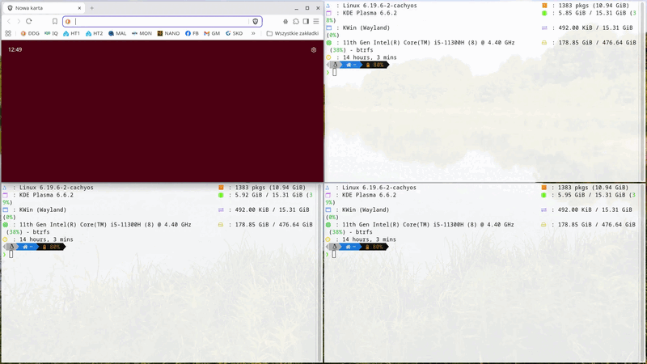

# 🧩 KLeftHandTiler


**Window tiling script for KWin (KDE Plasma 6+)**

Designed for **left-hand keyboard shortcuts**, **per-desktop/activity layouts**,  
**drag-to-reorder windows**, and a **constraint-aware layout engine with live resize**.

---

## 🚀 What's new in v2.1

- 🧠 Improved layout validation (safer geometry)
- 🧩 Better grid + first-row logic
- 🧱 Floating windows for non-fitting cases
- 🛡 Crash prevention & safety checks
- 🔄 Smarter auto-retile
- ⚡ More stable live resize
- 🧮 Better minimum size handling
- 🔔 New OSD system (layout, ratio, warnings)
- 🚫 Improved plasmashell/system window filtering
---

## 🎬 Preview


---

## 🧭 Typical workflow

1. Open windows  
2. Press **Ctrl + Shift + `** → tile / cycle layout  
3. Drag window → drop near another → reorder  
4. Resize window → layout updates in real-time  
5. Press **Ctrl + Shift + `** → cycle layouts  
6. Close or minimize → layout auto-adjusts  
7. Press **Ctrl + Esc** → cycle focus  
8. Switch desktop/activity → layout restored  

Optional:
- Double-tap **Ctrl + Shift + `** → maximize all  
- Press **Ctrl + Shift + F1** → change main ratio  

---

## ✨ Features


### 🧠 Layout engine

- model-based (rows + ratios)  
- stable and predictable  
- safer geometry handling  

---

### 🔄 Live resize

- real-time layout updates  
- affects only adjacent windows  
- no global scaling  

---

### 📐 Constraint-aware tiling

- respects minimum window sizes  
- prevents invalid layouts  
- avoids overlaps and broken geometry  

---

### 🧩 Left-main layouts

- main + stack/grid  
- correct boundary resizing  
- preserved proportions  

---

### 🧱 Floating windows

If a window cannot fit:
- it is excluded from tiling  
- layout remains valid  
- no crashes  

---

### 🔔 OSD (On-Screen Display)

- shows current layout name  
- shows main ratio  
- warnings:
  - no space for window  
  - too many windows  
- throttled (no spam)  

---

### ⚡ Smart auto-retile

Triggers:
- new window  
- close  
- minimize / restore  
- desktop change  
- activity change  

---

### 🔁 Auto-retile modes

| Mode       | Shortcut           | Behavior |
|------------|------------------|----------|
| OFF        | Ctrl+Shift+F2    | disabled |
| Tiled only | Ctrl+Shift+F3    | skip if any window is maximized |
| Always     | Ctrl+Shift+F4    | always retile |

---

### 🧱 Adaptive layouts

Cycle layouts:

    Ctrl + Shift + `

- adapts to window count  
- main + stack / grid  

---

### 📐 Ratio presets



Shortcut:

    Ctrl + Shift + F1

Presets:

    1.5 → 2 → 3 → 1

Used for controlling the **main vs secondary window proportions**.


---
### 🔀 Swap windows (directional)

You can swap the active window with a neighboring window using directional shortcuts:

| Shortcut | Action |
|----------|--------|
| Meta+Ctrl+Alt+Arrows | Swap windows (directional) |


✔ works in all layouts (grid, left-main, top)  
✔ respects layout structure  
✔ keeps proportions stable  

Useful for quickly reorganizing layout without using the mouse.

---

### 🖱 Drag-to-reorder

    drag → drop near → reorder

---

### 🧲 Sticky edges

Snap windows to layout boundaries during resize.

---

### 🎛 Visual tuning

- window gaps  
- screen margins  

---

## 🚫 Ignore system (accurate)

Window exclusion combines **user-defined rules** and **automatic filtering**.

---

### 🔤 Keyword lists (user configuration)

Configured in settings:

- **tiling ignore list**
- **cycling ignore list**

Each entry is matched against:

- window **caption (title)**
- window **class (`resourceClass`)**
- window **name (`resourceName`)**

Matching:
- case-insensitive  
- substring-based  

Examples:
```
settings
print
brave
org.kde
```

✔ Match in **any field** excludes the window.

---

### 🧩 Window property filtering (automatic)

Ignored if:

- not a normal window (`!normalWindow`)
- unmanaged (`!managed`)
- minimized
- special window
- dock
- desktop window
- skipTaskbar
- popup
- dialog
- utility window
- deleted

---

### 🔗 Desktop & activity filtering

Window must belong to:

- current desktop  
- current activity (unless `onAllActivities`)  

---

### 🚫 Launcher detection

Ignored automatically:

- Plasma shell (`org.kde.plasmashell`)  
- special + skipTaskbar + non-normal  

---

### 🧲 Transient / modal filtering

Optional (config):

- transient windows  
- modal dialogs  

Controlled by:

    ignoreTransientWindows

---

### ⚙️ Behavior

Ignored windows:

- are excluded from layout  
- may be automatically minimized (tiling ignore)  
- are skipped during cycling  

---

## ⌨ Default shortcuts

### 📐 Tiling

| Shortcut | Action |
|----------|--------|
| Ctrl+Shift+` | Tile / Cycle / double-tap → maximize |
| Ctrl+Shift+F1 | Cycle ratio presets |
| Ctrl+Shift+Esc | Rotate windows |

---

### 🪟 Window control

| Shortcut | Action |
|----------|--------|
| Ctrl+` | Toggle maximize / double-tap → minimize |
| Ctrl+CapsLock | Double-tap → fullscreen toggle |
| Ctrl+Esc | Cycle visible windows |
| Ctrl+! | Restore last minimized window |

---

### 🔁 Layout manipulation

| Shortcut | Action |
|----------|--------|
| Meta+Ctrl+Alt+Left  | Swap with left |
| Meta+Ctrl+Alt+Right | Swap with right |
| Meta+Ctrl+Alt+Up    | Swap with top |
| Meta+Ctrl+Alt+Down  | Swap with bottom |
| Meta+Alt+X          | Grow active window |
| Meta+Alt+Z          | Shrink active window |

---

### 🔄 Auto-retile

| Shortcut | Action |
|----------|--------|
| Ctrl+Shift+F2 | OFF |
| Ctrl+Shift+F3 | Tiled only |
| Ctrl+Shift+F4 | Always |

---

## ⚙️ Configuration

Open:

    System Settings → Window Management → KWin Scripts → KLeftHandTiler → Configure

---

### Layout

- default preset index  
- auto-retile mode  
- tile on start  

---

### Auto-retile triggers

- new window  
- window close  
- minimize / restore  
- desktop change  
- activity change  

---

### Layout tuning

- gap between windows  
- screen margin  
- reorder threshold  

---

### Interaction

- double-tap threshold  
- ignore transient windows  

---

### 🚫 Ignore configuration

User-defined lists apply to:

- window caption  
- resourceClass  
- resourceName  

Used for:

- tiling ignore  
- cycling ignore  

---

### ⚠️ Important

Configuration changes require reload:

    disable → enable KLeftHandTiler

---

## 📦 Installation

### Recommended (.kwinscript)

1. Download release  
2. Open KWin Scripts  
3. Install from file  
4. Enable  

---

### Manual

    git clone https://github.com/mtriam/KLeftHandTiler.git
    cd KLeftHandTiler
    chmod +x KLeftHandTiler.sh
    ./KLeftHandTiler.sh install

---

## 🗑 Uninstall

    ./KLeftHandTiler.sh uninstall

---

## 🛠 Management

    ./KLeftHandTiler.sh status
    ./KLeftHandTiler.sh enable
    ./KLeftHandTiler.sh disable
    ./KLeftHandTiler.sh remove
    ./KLeftHandTiler.sh unload

---

## 🧠 Development

    src/
      metadata.json
      contents/
        code/main.js
        config/main.xml
        ui/config.ui

Installed to:

    ~/.local/share/kwin/scripts/KLeftHandTiler

---

## 🎞 Optional: Smooth window animations

KLeftHandTiler does not provide animations by itself (by design — for performance and stability).

If you want smooth animated transitions when windows resize or move, you can install the external KWin effect:

👉 https://github.com/peterfajdiga/kwin4_effect_geometry_change

---

### 📦 Installation

Download and extract the effect:

wget https://github.com/peterfajdiga/kwin4_effect_geometry_change/releases/download/v1.5/kwin4_effect_geometry_change_1_5.tar.gz
 -O /tmp/kwin4_effect_geometry_change_1_5.tar.gz && tar -xvzf /tmp/kwin4_effect_geometry_change_1_5.tar.gz -C ~/.local/share/kwin/effects/

 ---

### ⚙️ Enable the effect

1. Open:

   System Settings → Window Management → Desktop Effects

2. Find:

   **"Geometry Change"**

3. Enable it ✅

---


## 🤖 About

Developed with AI assistance.  
Final design and decisions by the author.

---

## 📜 License

GPL-3.0

---

## 👤 Author

triamond
